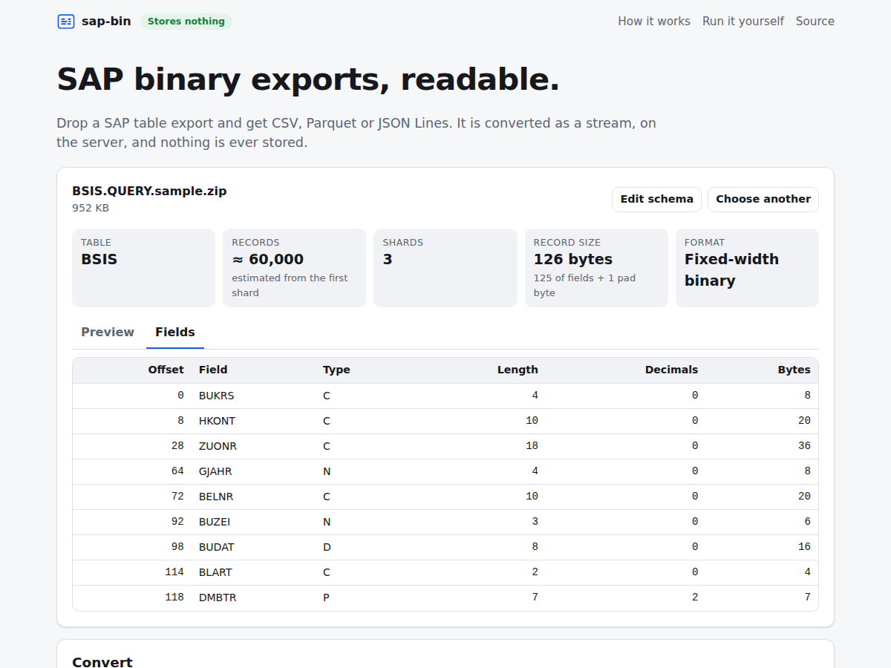
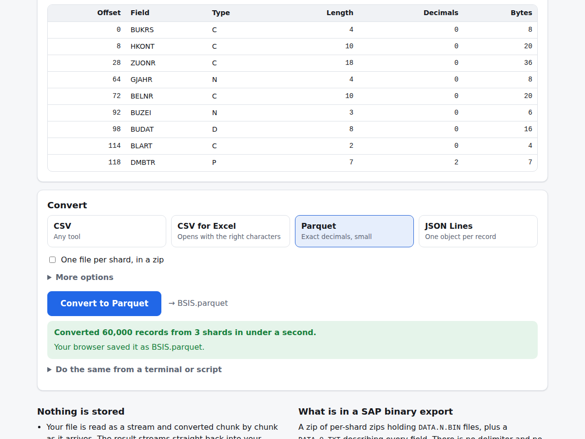
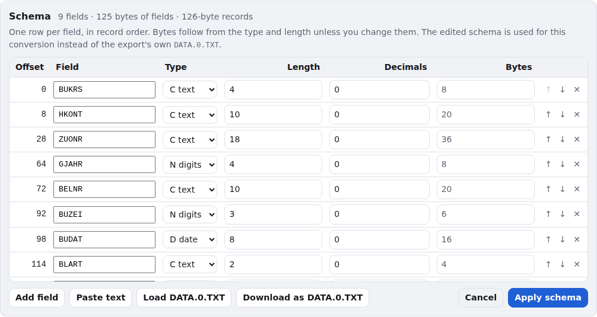

[Overview](../README.md) · **Web** · [App & CLI](cli.md) · [Python](python.md) · [Docker](docker.md) · [HTTP API](http-api.md) · [Privacy](privacy.md) · [Performance](performance.md) · [Export format](format.md)

# The web page

The page is the same whether it runs at
**[tools.eidox.io/sap-bin-parser](https://tools.eidox.io/sap-bin-parser/)**, on your own
computer ([the app](cli.md)), or in [your own container](docker.md). Nothing you convert is
stored ([how](privacy.md)).

## Drop, glance, convert

1. **Drop** the export on the page, or choose files or a folder.
2. **Glance.** Within a second the page shows the table, the shard count, the record count,
   the record geometry and the first 20 records. It reads only the first 4 MB and the last
   256 KB of the file to do this.
3. **Convert.** Pick CSV, CSV for Excel, Parquet or JSON Lines and press the button. Your
   browser's download manager saves the result, so output of any size goes straight to
   disk, while the page shows records per second and the time left.

## What it accepts

- **The delivered `.zip`**, which carries its own schema (`DATA.0.TXT`).
- **The unzipped export folder**: drop it, or use *Choose folder*.
- **Separate `DATA.N.BIN` files** with their `DATA.0.TXT`, chosen together and converted
  as one export.
- **A `.BIN` with no schema at all.** The schema editor opens: type the fields in, or paste
  them from SE11 or a spreadsheet.

## The schema editor

*Edit schema* opens the fields in a table. Bytes follow from the type and length unless you
change them, and the running total shows the record size they add up to. *Paste text*
accepts a whole `DATA.0.TXT`, or short lines such as `BUKRS C 4` and `DMBTR P 7 2`. An
edited schema replaces the export's own for this conversion, and *Download as DATA.0.TXT*
keeps it for next time.

## When records do not line up

If the schema does not fit the data, the page says so in words, names the failing record
and field, and lists the record sizes that decode cleanly. One click applies a suggestion.
Under *More options*, *If a record will not decode* can instead leave bad values empty and
carry on, counting them.

## Options

| Option | |
|---|---|
| Amounts | exact decimals (default), or floating point |
| Record size | override the size the schema implies |
| Only the first N records | a quick sample |
| CSV delimiter | comma, semicolon, tab or pipe; *CSV for Excel* picks semicolons where the locale writes decimals with a comma |
| Parquet compression | zstd (default), snappy, gzip or none |
| Text shard encoding | for tab-separated `.TXT` shards; windows-1251 by default |
| One file per shard | a zip with one output file per shard |

Every conversion also shows the equivalent `sap-bin` and `curl` command, ready to copy.
